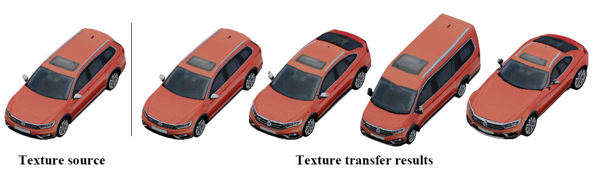
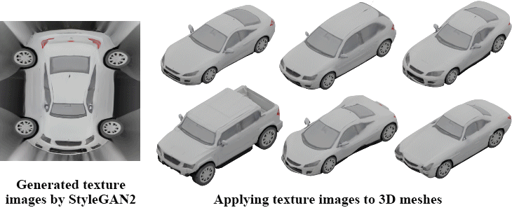

# AUV-Net
PyTorch implementation for paper [AUV-Net: Learning Aligned UV Maps for Texture Transfer and Synthesis](https://arxiv.org/abs/2204.03105), by [Zhiqin Chen](https://czq142857.github.io/), [Kangxue Yin](https://kangxue.org/), and [Sanja Fidler](https://www.cs.utoronto.ca/~fidler/).

### [Paper](https://arxiv.org/abs/2204.03105)  |   [Video](https://youtu.be/rsGsN96EUv8)  |   [Project page](https://nv-tlabs.github.io/AUV-NET/)






## Dependencies

The code has been tested on Ubuntu.
The required packages are listed in *requirements.yml*.
We recommend using conda to set up the environment; simply run the following scripts.
```
conda env create --file requirements.yml
conda activate auvnet
```

Run this script to build cython modules.
```
python setup.py build_ext --inplace
```


## Datasets

Please see *data_preparation* folder.


## Training

Note: the code only uses the first 80% of the shapes for training.
If you want to train on all the shapes, add ```--use_all_data``` to all the commands in the .sh files.

Change *data_dir* in the .sh files before running the following scripts.

To train AUV-Net on the car category of ShapeNet, run the following script.
```
sh script/train_car.sh
```

## Obtaining aligned texture images

To obtain aligned texture images, run the following script.
```
sh script/test_car.sh
```
The aligned texture images and their meshes with uv coordinates are written to folder *aligned_textures*.


## Texture transfer
Simply swap the aligned texture images of two meshes.

Run the following script to quickly obtain an 8x8 table of geometry-texture hybrid shapes written in folder *hybrid*.
```
python utilities/demo_texture_transfer.py
```


## Citation
If you find our work useful in your research, please consider citing:

	@inproceedings{chen2022AUVNET,
		title = {AUV-Net: Learning Aligned UV Maps for Texture Transfer and Synthesis}, 
		author = {Zhiqin Chen and Kangxue Yin and Sanja Fidler},
		booktitle = {The Conference on Computer Vision and Pattern Recognition (CVPR)},
		year = {2022}
	}


## License

Copyright &copy; 2022, NVIDIA Corporation & affiliates. All rights reserved.

This work is made available under
the [Nvidia Source Code License](https://github.com/nv-tlabs/AUV-NET/blob/master/LICENSE.txt)
.
