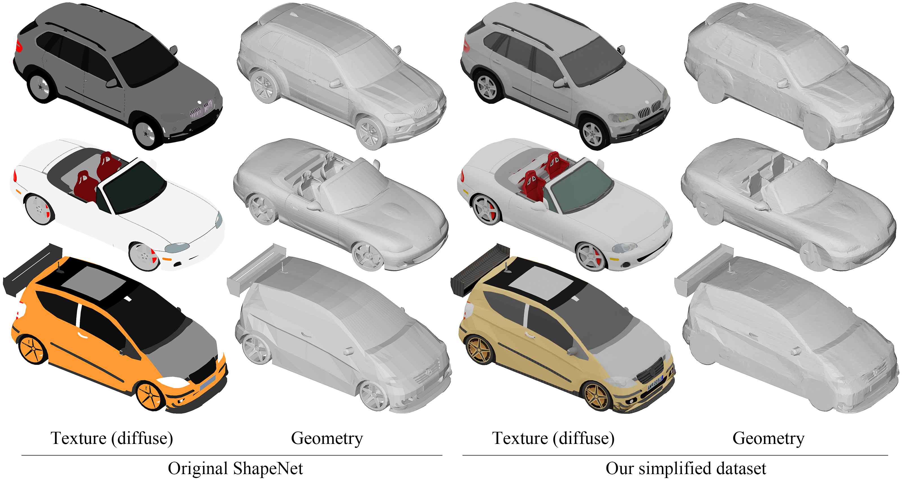

# AUV-Net data preparation
Data preparation code for paper AUV-Net: Learning Aligned UV Maps for Texture Transfer and Synthesis.

This repo provides code to create the simplified [ShapeNet](https://www.shapenet.org/) car dataset, and the training data for AUV-Net.
The simplified ShapeNet dataset is generated by simplfying the meshes to remove geometric details and baking those details into texture images, as shown below.



## Dependencies

In addition to the packages listed in *requirements.yml* in the main repo, the following are required.

1. Download and unzip [blender](https://www.blender.org/).
[Blender 2.93.2](https://download.blender.org/release/Blender2.93/blender-2.93.2-linux-x64.tar.xz) was used in our experiments.

2. Download the linux executable of [binvox](https://www.patrickmin.com/binvox/). 
Then run ```chmod +x binvox``` to make it executable.

3. Download and unzip [ShapeNet](https://www.shapenet.org/) V1.

The folders should structure like this:
```
├── blender
│   ├── blender (the executable)
│   └── others
└── data_preparation
    ├── 02958343 (the folder from ShapeNet V1)
    ├── *.py
    ├── binvox (the executable)
    └── template.blend
```


## Usage

It is recommended to split the shapes in the dataset into several chunks and run them in separate processes (even on several different machines), because the data preparation code is slow. For instance, to split into 4 chunks (4 processes), open 4 terminals and run one of the following commands in each terminal:
```
python <file_name>.py <category_id> 0 4
python <file_name>.py <category_id> 1 4
python <file_name>.py <category_id> 2 4
python <file_name>.py <category_id> 3 4
```

But beware of your memory usage on your machines. Some code could take a lot of CPU memory, and may OOM if you have too many processes.

For conciseness, we use only one process in the following examples.

<br/>

**Step 1.** Run the following script to obtain simplified meshes and prepare for texture baking.
```
python simplify_mesh.py 02958343 0 1
```

<br/>

**Step 2.** Run blender to render multiple views.
```
../blender/blender template.blend --background --python render.py -- 02958343 0 1 > /dev/null 2>&1
```

```> /dev/null 2>&1``` is to disable terminal messages.
For debugging, you might want to remove that to see error messages.

<br/>

**Step 3.** Run the following script to obtain textured simplified meshes.
```
python get_textured_mesh.py 02958343 0 1
```

Now you have the simplified ShapeNet shapes with baked textures, in folder *02958343_simplified_textured*.

<br/>

**Step 4.** To obtain AUV-Net training data, Run the following script.
```
python get_pointcloud_voxel.py 02958343 0 1
```


